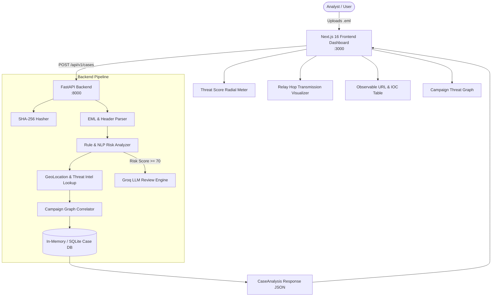

# 🛡️ TraceShield AI (SIH26106 MVP)
### AI-Powered Email Threat Detection, GeoLocation & Forensic Intelligence Platform

> **Smart India Hackathon 2026** | **Problem Statement ID:** SIH26106  
> **Organization:** All India Council for Technical Education (AICTE)  
> **Theme:** Blockchain & Cybersecurity | **Category:** Software  

---

## 📌 Table of Contents
1. [Overview](#-overview)
2. [End-to-End System Architecture](#-end-to-end-system-architecture)
3. [⚡ Quick Start Guide (Run in 3 Minutes)](#-quick-start-guide-run-in-3-minutes)
4. [👥 6-Member Team Roles & Edit Boundaries](#-6-member-team-roles--edit-boundaries)
5. [🌿 Git Branching & Collaboration Workflow](#-git-branching--collaboration-workflow)
6. [📂 Repository Directory Structure](#-repository-directory-structure)
7. [🔌 API Reference & Data Contracts](#-api-reference--data-contracts)
8. [🧪 Testing & Demo Fixtures](#-testing--demo-fixtures)

---

## 🚀 Overview

**TraceShield AI** is an explainable, forensic-grade email threat investigation platform designed to identify, dissect, trace, and correlate deceptive email campaigns (Phishing, BEC, Spoofing, Account Takeovers).

### 🔄 The Core Analysis Flow
```text
Upload .eml File 
  │
  ├── 1. SHA-256 Artifact Cryptographic Hashing (Evidence Preservation)
  ├── 2. Deep Header & MIME Parser (SPF, DKIM, DMARC, Received Relay Chain)
  ├── 3. Threat Engine & Risk Scoring (0–100 Score with Deterministic Reason Codes)
  ├── 4. OSINT GeoLocation & Infrastructure Enrichment (Origin IP, ASN, WHOIS, Domain Age)
  ├── 5. Tier 2 Explainable LLM Review (Groq Llama 3.3 / OSS models for high-risk cases)
  ├── 6. Graph-Based Campaign Correlation (Clustering related attacks across case histories)
  └── 7. Real-Time Analyst Dashboard & Exportable Forensic Report
```

---

## 🏗️ End-to-End System Architecture



---

## ⚡ Quick Start Guide (Run in 3 Minutes)

### 📋 Prerequisites
- **Python 3.10+**
- **Node.js 18+** & **npm**
- **Git**
- **Groq API Key** (Free tier from [console.groq.com](https://console.groq.com))

---

### 1️⃣ Clone the Repository
```bash
git clone https://github.com/driveadityayadav18-art/sih26106-mvp.git
cd sih26106-mvp
```

---

### 2️⃣ Backend Setup
```bash
# 1. Navigate to backend
cd backend

# 2. (Optional but recommended) Create virtual environment
python -m venv .venv

# Windows activation:
.venv\Scripts\activate
# Linux/macOS activation:
# source .venv/bin/activate

# 3. Install Python dependencies
pip install -r requirements.txt

# 4. Set up your environment variables
# Copy the template to .env.local
cp .env.example .env.local

# Edit .env.local and add your Groq API key:
# GROQ_API_KEY=gsk_your_actual_groq_api_key_here

# 5. Start the FastAPI backend
uvicorn main:app --reload --port 8000
```
> 🌐 Backend will be running at: `http://localhost:8000`  
> 📖 Swagger API Docs: `http://localhost:8000/docs`

---

### 3️⃣ Frontend Setup
Open a **new terminal tab/window**:
```bash
# 1. Navigate to frontend
cd frontend

# 2. Install Node dependencies
npm install

# 3. Start Next.js development server
npm run dev
```
> 💻 Frontend UI will be running at: `http://localhost:3000`

---

### 4️⃣ Quick Health Check Verification
In another terminal or browser:
```bash
curl http://localhost:8000/api/v1/health
# Expected output: {"status":"ok"}
```

---

## 👥 6-Member Team Roles & Edit Boundaries

To ensure rapid progress without stepping on each other's code or creating merge conflicts, each teammate has a **designated role**, **dedicated branch**, and **strict file editing boundaries**.

> 💡 **AI Assistant Instructions:** Every teammate has a personalized master context prompt located in [`docs/`](./docs). When using Cursor, Claude, ChatGPT, or Antigravity, paste your respective prompt (`docs/Person X ...`) as your initial instruction.

| Role | Teammate Focus | Dedicated Branch | Allowed File Boundaries | Master Prompt |
| :--- | :--- | :--- | :--- | :--- |
| **Person 1** | **Team Leader / Platform Architect & Integration Lead** | `person-1/platform-api` | `backend/main.py`, `backend/core/`, `backend/models/`, API routers, root config | [`Person-1-Master-Prompt.md`](./docs/Person-1-Master-Prompt.md) |
| **Person 2** | **EML Parsing & Header Forensics Specialist** | `person-2/eml-forensics` | `backend/parser/`, email MIME decoding, DKIM/SPF/DMARC validators, header extractors | [`Person 2 — Master AI Context Prompt.md`](./docs/Person%202%20—%20Master%20AI%20Context%20Prompt.md) |
| **Person 3** | **Detection Engine & Threat Scoring Specialist** | `person-3/detection-engine` | `backend/detection/`, heuristic rules, reason codes, BEC pattern matching, scoring algorithms | [`Person 3 — Master AI Context Prompt.md`](./docs/Person%203%20—%20Master%20AI%20Context%20Prompt.md) |
| **Person 4** | **Frontend Lead & Analyst UI/UX Developer** | `person-4/analyst-ui` | `frontend/src/`, `frontend/components/`, styles, UI charts, IOC tables | [`Person 4 — Master AI Context Prompt.md`](./docs/Person%204%20—%20Master%20AI%20Context%20Prompt.md) |
| **Person 5** | **OSINT, GeoLocation & Campaign Correlation Engineer** | `person-5/intel-correlation` | `backend/intel/`, `backend/data/demo_intel.json`, GeoIP lookup, graph clustering | [`Person 5 — Master AI Context Prompt.md`](./docs/Person%205%20—%20Master%20AI%20Context%20Prompt.md) |
| **Person 6** | **Forensic Reporting, QA & Demo Operations Lead** | `person-6/qa-reporting-demo` | `data/fixtures/`, `backend/reporting/`, test scripts (`test_detection.py`), audit logs | [`Person 6 — Master AI Context Prompt.md`](./docs/Person%206%20—%20Master%20AI%20Context%20Prompt.md) |

---

### Detailed Responsibility & Permission Matrix

```
┌────────────────────────┬───────────────────────────────────────┬──────────────────────────────────────────┐
│ Teammate               │ Primary Responsibilities              │ STRICT Allowed Edit Scope                │
├────────────────────────┼───────────────────────────────────────┼──────────────────────────────────────────┤
│ Person 1               │ • API contracts & FastAPI orchestration│ • backend/main.py                        │
│                        │ • Global error handling & middleware  │ • backend/core/ & backend/models/        │
│                        │ • Data persistence & CORS configuration│ • Root configs (.gitignore, README.md)   │
│                        │ • Reviewing and merging pull requests │ • Integration health & Docker/infra      │
├────────────────────────┼───────────────────────────────────────┼──────────────────────────────────────────┤
│ Person 2               │ • Deep .eml MIME parsing              │ • backend/parser/ (or parsing functions) │
│                        │ • Received-header hop reconstruction  │ • MIME attachment extractors             │
│                        │ • SPF / DKIM / DMARC authentication   │ • Header anomaly checkers                │
│                        │ • Canonicalizing email bodies & URLs  │ ❌ DO NOT edit UI or detection rules     │
├────────────────────────┼───────────────────────────────────────┼──────────────────────────────────────────┤
│ Person 3               │ • Rule engine (URGENT_SUBJECT, etc.)  │ • backend/detection/ (or risk functions) │
│                        │ • Risk score computation (0-100)      │ • Deterministic reason code mappings     │
│                        │ • Heuristic & BEC keyword detection   │ • Tier-2 Groq prompt engineering         │
│                        │ • Explainable decision logic          │ ❌ DO NOT edit frontend or GeoIP parsers │
├────────────────────────┼───────────────────────────────────────┼──────────────────────────────────────────┤
│ Person 4               │ • Next.js Analyst Dashboard           │ • frontend/src/app/                      │
│                        │ • Radar/Radial risk meters & badges   │ • frontend/src/components/               │
│                        │ • Interactive IOC & URL tables        │ • frontend/src/types/                    │
│                        │ • Dark-mode cybersecurity aesthetics  │ ❌ DO NOT modify backend logic           │
├────────────────────────┼───────────────────────────────────────┼──────────────────────────────────────────┤
│ Person 5               │ • Origin IP Geolocation extraction    │ • backend/intel/                         │
│                        │ • ASN / ISP / Proxy / VPN tagger      │ • backend/data/demo_intel.json           │
│                        │ • WHOIS & Domain Age resolution       │ • Campaign graph node/edge linking       │
│                        │ • Cross-case threat correlation       │ ❌ DO NOT edit frontend or core parser   │
├────────────────────────┼───────────────────────────────────────┼──────────────────────────────────────────┤
│ Person 6               │ • Chain-of-custody audit logs         │ • data/fixtures/*.eml                    │
│                        │ • Verifiable forensic report exporter │ • backend/test_detection.py & tests      │
│                        │ • Curating malicious & clean fixtures │ • backend/reporting/ (PDF/JSON export)   │
│                        │ • Live demo rehearsal automation      │ ❌ DO NOT rewrite core API schemas       │
└────────────────────────┴───────────────────────────────────────┴──────────────────────────────────────────┘
```

---

## 🌿 Git Branching & Collaboration Workflow

To maintain a clean codebase that never breaks during testing or judging:

```mermaid
gitgraph
   commit id: "Initial MVP Baseline"
   branch person-2/eml-forensics
   branch person-4/analyst-ui
   checkout person-2/eml-forensics
   commit id: "feat: add DMARC parser"
   checkout person-4/analyst-ui
   commit id: "feat: update score gauge"
   checkout main
   merge person-2/eml-forensics id: "PR #1 (Approved by Lead)"
   checkout person-4/analyst-ui
   commit id: "fix: link parser fields"
   checkout main
   merge person-4/analyst-ui id: "PR #2 (Approved by Lead)"
```

### 🔒 Core Git Rules
1. **`main` is protected:** NEVER push directly to `main`. `main` must always be runnable for live demos.
2. **Branch from `main`:** Before starting new work, pull latest `main` and branch out:
   ```bash
   git checkout main
   git pull origin main
   git checkout -b person-X/your-feature-name
   ```
3. **Commit often with semantic messages:**
   ```bash
   git add .
   git commit -m "feat(parser): add DKIM header verification logic"
   ```
4. **Push your branch to GitHub:**
   ```bash
   git push origin person-X/your-feature-name
   ```
5. **Open a Pull Request (PR):**
   - Go to GitHub, open PR into `main`.
   - Ensure all automated unit tests (`python backend/test_detection.py`) pass.
   - Assign **Person 1 (Team Leader)** to review and merge.

---

## 📂 Repository Directory Structure

```text
traceshield-mvp/
├── .gitignore                   # Global ignore rules (ignores .env*, node_modules, .next, __pycache__)
├── README.md                    # Main Project Onboarding & Collaboration Guide
├── backend/
│   ├── .env.example             # Environment variable template
│   ├── .env.local               # Local secrets (NEVER committed)
│   ├── main.py                  # FastAPI Orchestrator & Endpoints
│   ├── requirements.txt         # Python dependencies
│   ├── test_detection.py        # Automated test suite
│   └── data/
│       └── demo_intel.json      # Offline threat intel & GeoIP lookup cache
├── data/
│   └── fixtures/                # Sample .eml emails for testing and live demos
│       ├── test_phishing.eml
│       ├── test_phishing_2.eml
│       └── Gaming Army Live has invited you to visit circleframe.eml
├── docs/                        # SIH Reference & Personalized AI Prompts (Person 1 - 6)
│   ├── psrefrence.md
│   ├── Person-1-Master-Prompt.md
│   ├── Person 2 — Master AI Context Prompt.md
│   ├── Person 3 — Master AI Context Prompt.md
│   ├── Person 4 — Master AI Context Prompt.md
│   ├── Person 5 — Master AI Context Prompt.md
│   └── Person 6 — Master AI Context Prompt.md
└── frontend/
    ├── package.json             # Next.js 16 dependencies
    ├── tsconfig.json            # TypeScript configuration
    ├── src/
    │   ├── app/                 # Next.js App Router (page.tsx, layout.tsx, globals.css)
    │   ├── components/          # Reusable UI components & charts
    │   │   ├── dashboard/       # Navbar, Headers, Case Views
    │   │   ├── ui/              # Buttons, Cards, Badges, Tables
    │   │   └── observable-url-table.tsx
    │   ├── lib/                 # Utility helpers (cn, formatters)
    │   └── types/               # TypeScript interfaces for CaseAnalysis
    └── public/                  # SVG icons & static assets
```

---

## 🔌 API Reference & Data Contracts

### 1. Health Check
- **`GET /api/v1/health`**
- **Response:**
  ```json
  { "status": "ok" }
  ```

### 2. Ingest & Analyze Email
- **`POST /api/v1/cases`**
- **Payload:** `multipart/form-data` with `file: UploadFile` (`.eml` file)
- **Response Schema (`CaseAnalysis`):**
  ```json
  {
    "case_id": "TS-DEMO-001",
    "artifact": {
      "sha256": "3a8c...7b1e",
      "is_demo_data": true
    },
    "message": {
      "subject": "URGENT: Verify Your Account Immediately",
      "from": { "name": "Security Team", "address": "support@service.example" },
      "reply_to": "attacker@evil.example",
      "return_path": "bounce@mailer.example",
      "urls": ["https://evil-login-phish.ru/verify"],
      "hops": [
        { "step": 1, "by": "mx.google.com", "from_ip": "185.220.101.5", "delay_seconds": 0 }
      ]
    },
    "risk": {
      "score": 90,
      "band": "HIGH",
      "reason_codes": [
        {
          "code": "REPLY_TO_MISMATCH",
          "description": "Reply-To header does not match From sender domain.",
          "evidence_path": "message.reply_to"
        },
        {
          "code": "URGENT_SUBJECT",
          "description": "Subject line exhibits high urgency / social engineering cues.",
          "evidence_path": "message.subject"
        }
      ]
    },
    "ai_review": {
      "verdict": "MALICIOUS_PHISHING",
      "confidence": 0.95,
      "executive_summary": "High-confidence credential harvesting attempt spoofing security alerts.",
      "threat_actor_ttp": ["T1566.002 - Spearphishing Link", "T1598 - Phishing for Information"]
    },
    "infrastructure": {
      "origin_ip": "185.220.101.5",
      "asn": "AS200000",
      "country": "Germany",
      "city": "Frankfurt",
      "isp": "Anonymized Cloud Hosting",
      "reputation": "SUSPICIOUS"
    },
    "campaign": {
      "campaign_id": "CAMP-PHISH-01",
      "related_case_ids": ["TS-DEMO-001", "TS-DEMO-002"],
      "similarity_score": 0.88
    }
  }
  ```

---

## 🧪 Testing & Demo Fixtures

### Run Backend Unit Tests
A built-in test suite verifies parser integrity, risk scoring thresholds, and reason code generation:
```bash
cd backend
python test_detection.py
```

### Testing with Sample Emails
You can test the system live by dragging and dropping sample files from `data/fixtures/` into the frontend UI at `http://localhost:3000`:
- **`data/fixtures/test_phishing.eml`**: Triggers High Risk (Score 90), Reply-To mismatch, urgent cues, suspicious URL, and activates Tier 2 LLM analysis.
- **`data/fixtures/test_phishing_2.eml`**: Secondary attack sample for testing campaign correlation.
- **`data/fixtures/Gaming Army Live has invited you to visit circleframe.eml`**: Real-world invitation/phishing sample for testing multi-hop relay parsing.

---

### 🛡️ Built for SIH 2026 | TraceShield AI Team
*Questions or integration issues? Coordinate with **Person 1 (Team Leader)**.*
